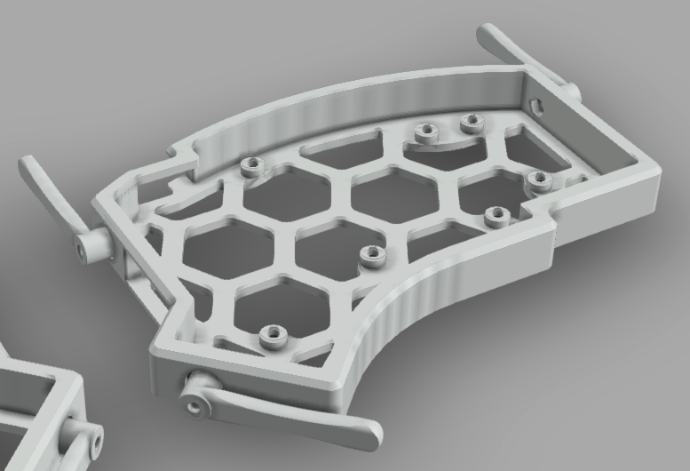
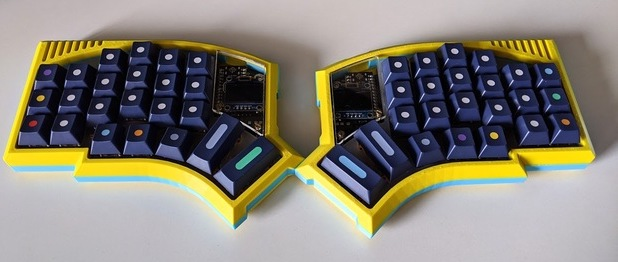

# 3D cases for the Kyria Keyboard

## onnenon case

The 3D printed case is compatible with revision 0.7 and up. There are two versions: one with and one without the Kyria logo on the inside of the case.

## jhelvy tent case

The 3D printed tent case is a modification of the onnenon 3D case that includes support for print-able legs.

## jbenner low profile tent case

A low profile modification of the jhelvy tent case.

## theol0403 "honeycomb" tent case

Another modification of the jhelvy tent case that includes a honeycomb back cutout.

V1 - Tent case with comb bottom and heat set inserts:
https://a360.co/3lyz5dD

V2 - Tent case with comb bottom and hex nut boxes:
https://a360.co/336cMn1

The m3 nut boxes for the legs are slightly smaller in V2 so that the legs properly screw on. Also, for V2 it prints best with no supports. Obviously you need supports for the overhangs at the very top of the case.

Here's a link to the modified tent leg so that they can be printed flat without supports: https://a360.co/3385Fum

## Druz320 case

Files here: https://www.thingiverse.com/thing:4503834
